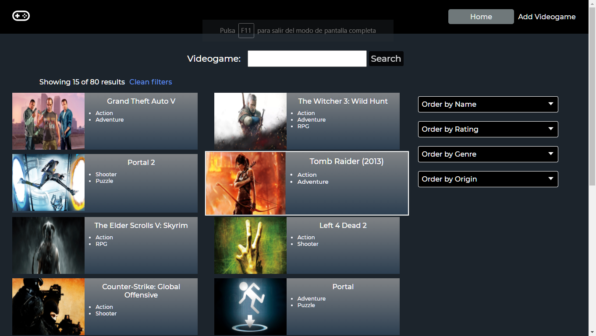

    

# Individual Project -  Videogames

The project consist of calling an API (https://rawg.io/apidocs) to show an initial set of 80 videogames in the /home page to see a variety of items and click over one and access to details about the platforms, genres, name, released date, etc. At the bottom of the page a pagination was created to navigate through the differents games brought by the API called.
In the right side filtering options allow the user to interect with the videogames originally requested. Filtering options by name, rate, genre, and origin (since a videogame can be found the in API or in a Database)
The app has its server from where all the calls are made.
The backend counts with its own database created in postgress, an user can create a new game which will be stored in the database after completing a from located in the /addvideogame route
Hope you like the App!

### API's endpoints used

  - GET https://api.rawg.io/api/games
  - GET https://api.rawg.io/api/games?search={game}
  - GET https://api.rawg.io/api/genres
  - GET https://api.rawg.io/api/games/{id}

## Installation

-Install all dependencies inside ./api folder

-Install all dependencies inside ./client folder

-Create a postgres database ('videogames')

-Go to https://rawg.io/apidocs and create an account in order to obtain an apiKey

-Once you have your apiKey, create a .env file in ./api with the following:

DB_USER={your postgres username}
DB_PASSWORD={your postgres password}
DB_HOST=localhost
DB_NAME={your postgres database name}
API_KEY_1={your spoonacular apiKey}

-Open a terminal and run "npm start" on ./api

-Open another terminal and run "npm start" on ./client

## Technologies

Front-end:
- [ ] React
- [ ] Redux
- [ ] Express
Back-end
- [ ] Sequelize - Postgres

#### Database

The database model has the following properties:

- [ ] Videogames:
  - ID
  - Name 
  - Description 
  - Released Date
  - Rating
  - Platforms 
- [ ] Genres:
  - ID
  - Name

#### Backend

Routes:

- [ ] __GET /videogames__:
  - A list of videogames (80 total)
- [ ] __GET /videogames?name="..."__:
  - Obtener un listado de las primeros 15 videojuegos que contengan la palabra ingresada como query parameter
  - Gets a list of 15 games that contains the word typed as a query parameter in the input bar
  - If the game does not exists, it show an image with no results
- [ ] __GET /videogame/{idVideogame}__:
  - Obtain the particular details of one game
- [ ] __POST /videogame__:
  - Recibe los datos recolectados desde el formulario controlado de la ruta de creación de videojuego por body
  - Receives the data collected in the form sent by the /addvideogames route
  - Creates a videogame in the database

#### Frontend
It was used React/Redux
Here some pictures of the implementation with the styling:

<h3>/landing</h3>
__Landing page__:
- [ ] background image
- [ ] Button to go to /home

    

<h3>/home</h3>

__Home page__: 
- [ ] Input to search games by name
- [ ] In the body of the page it is displayed all the games with this information
  - Image
  - Name
  - Genre
- [ ] Buttons/Options to filter the games by genre and videogame from the API or database (added by the user)
- [ ] Buttons/Options to filter the games by name (asc/desc) and also by rating
- [ ] Pagination to search and show the next set of games, 15 games per page,showing the first 15 in the page number one.

    

<h3>/addvideogames</h3>

__Addgames Route__: 
- [ ] A controlled form with the following fields
  - Name
  - Description
  - Released Date
  - Rating
- [ ] Possibility to select/add several genres
- [ ] Possibility to select/add several platforms 
- [ ] Button/Option to add a new game to the database

    

<h3>home/:videogameid</h3>

__Details Route__: displays:
- [ ] Image
- [ ] Name
- [ ] Genre
- [ ] Description
- [ ] Released Date
- [ ] Rating
- [ ] Platforms

    

